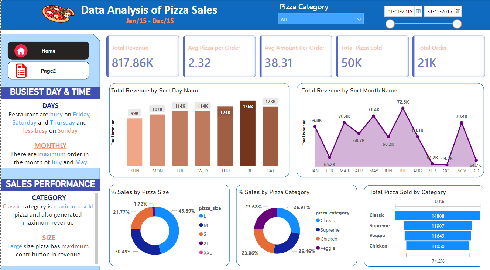
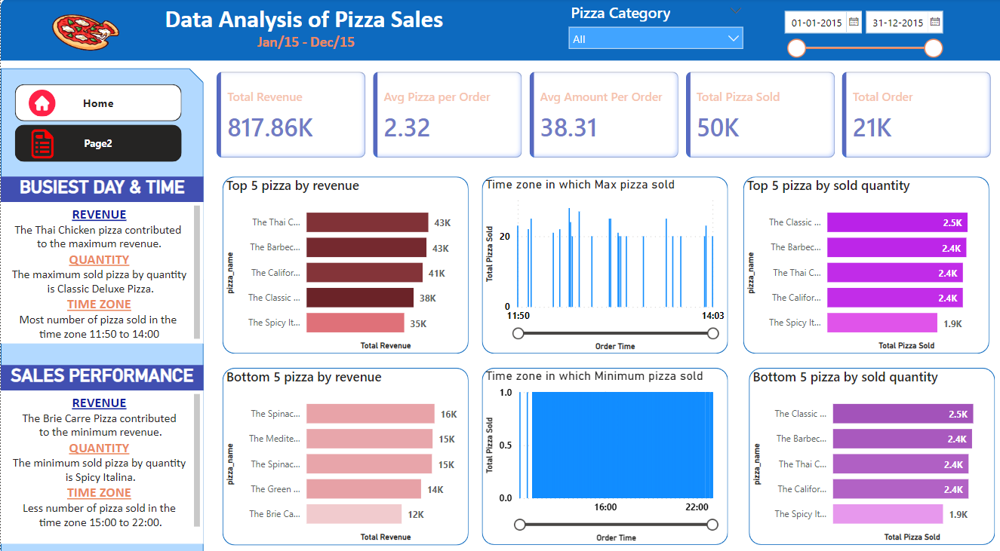

## Sales Analysis 
I conducted an extensive sales analysis for a pizza restaurant utilizing MySQL, where I identified pivotal factors influencing maximum revenue such as peak sales days, popular pizza sizes, and customer preferences for specific pizza varieties. Employing Power BI, I transformed the MySQL data into insightful visual representations, empowering data-driven decision-making within the restaurant. Additionally, I pinpointed peak and off-peak hours for pizza sales, allowing for the optimization of restaurant operations to align with specific time-bound demand, providing invaluable insights for strategic business planning.

